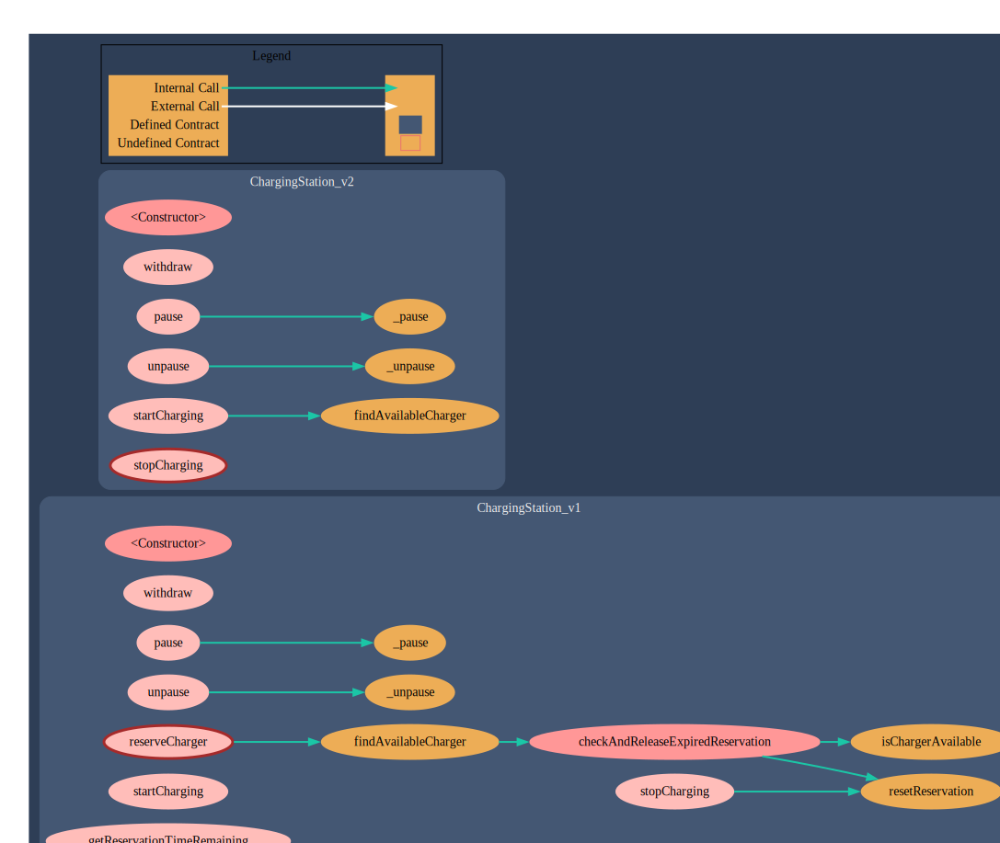

# Solidity Exercises

This repository contains four smart contracts developed during the Solidity module of the Blockchain course I've been attending to. Each contract demonstrates different aspects of Solidity programming and blockchain application development.

## Contracts Overview

This repository includes the following smart contracts:

1. **ChargingStation** - A contract for managing EV charging stations
2. **Banco** - A banking contract that allows deposits, withdrawals, and loans with interest
3. **Agenda** - A contact management system with multiple implementations (single/multi-user and access controls)
4. **SimpleStorage** - A simple storage contract with various implementations exploring Solidity features

## ChargingStation Contract

The ChargingStation contract is the main highlight of this repository. It implements a fictional decentralized system for electric vehicle charging station management.

### Features

- Manage charging station registration
- Track charging sessions
- Handle payments between users and station operators
- Dynamic pricing mechanisms
- Role-based access control

### Contract Visualization



## Testing

The ChargingStation contract includes comprehensive test coverage using Foundry, a fast and flexible Ethereum development framework.

### Running the Tests

```bash
cd /workspaces/SolidityExercises
forge test
```

### Test Coverage

The tests cover various scenarios including:
- Station registration
- User authentication
- Charging session management
- Payment processing
- Error handling

## Set up

To work with these contracts:

1. Clone the repository
2. Install dependencies:
   ```bash
   forge install
   ```
3. Compile the contracts:
   ```bash
   forge build
   ```